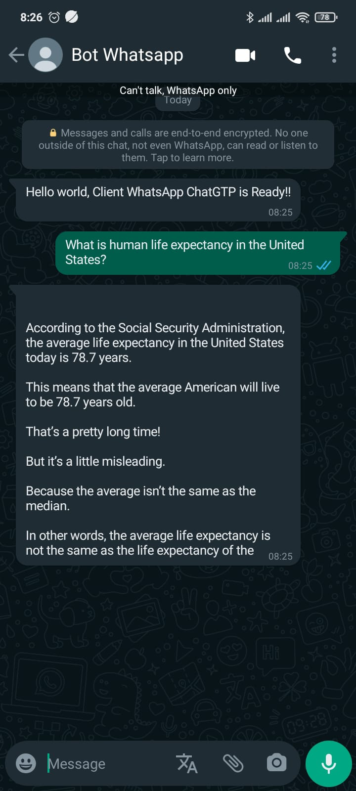

### WhatsApp Bot with OpenAI

> (Open Source Project) Simple bot application integrated with open ai API for generate answer of the quetions

---

## Table of contents

- [Table of contents](#table-of-contents)
- [Prerequiste](#prerequiste)
- [Stacks](#stacks)
- [Installation and Cofiguration](#installation)
- [Screen Capture](#capture)

## Prerequiste

- [node js](https://nodejs.org/en/) - Download and Install Composer

## Stacks or Depedencies

- Node JS
- dotenv
- dotenv
- OpenAI Package
- whatsapp-web.js
- qrcode-terminal

## Installation

1. Clone repository

```bash
$ git clone https://github.com:Zainal21/WhatsApp-Bot-with-OpenAI.git
```

2. move to directory project and Install depedencies

```bash

$ cd WhatsApp-Bot-with-OpenAI

$ yarn install or npm install
```

3. Setup your environment variabl in `.env` files or rename `.env.example to .env`.

4. run script and scan qr code to your phone

```bash
$  node app.js
```

## Screen Capture Result

- Answer Question
  

---

Copyright © 2023 by Muhamad Zainal Arifin
